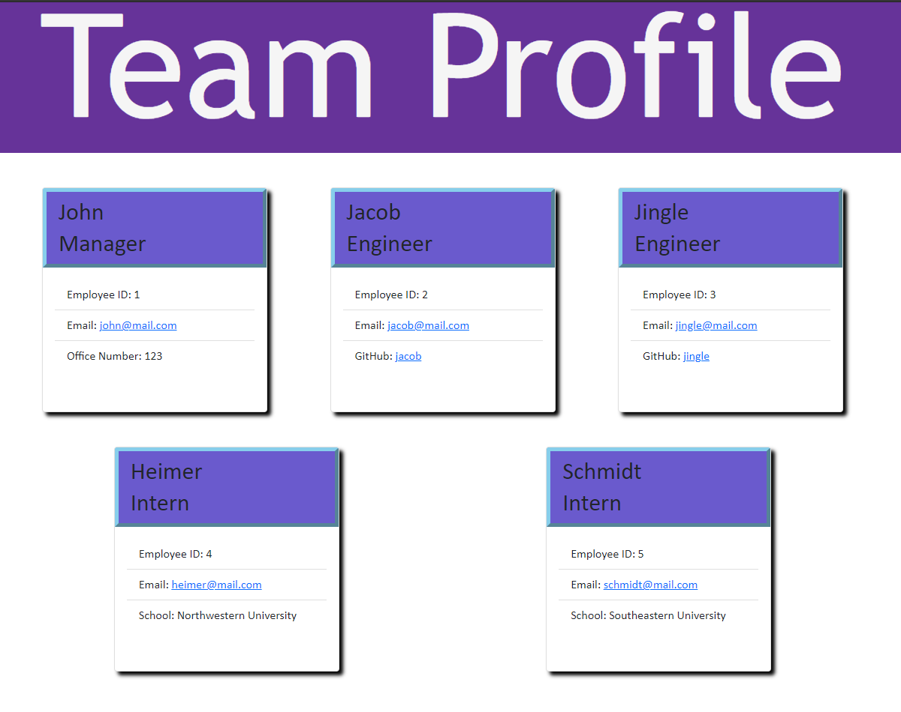

# Team Profile Generator
            
## Description
A Node.js command-line application that takes in information about employees on a software engineering team, then generates an HTML webpage that displays summaries for each person.
Each profile displays the employee's name, ID number, and email address. The email address of each employee in the HTML when clicked populates the TO field of an email with the email address of the employee.
The manager will have their office number displayed while engineers will have their GitHub username and interns will have their university. The GitHub username of each engineer opens a link to their github profile in a new tab.

## Table of Contents
* [Installation](#installation)
* [Usage](#usage)
* [Screenshot](#screenshot)
* [Link to Video](#link)
* [License](#license)
* [Contributing](#contributing)
* [Tests](#tests)
* [Questions](#questions)
            
## Installation
This application uses the inquirer package. On the command line, enter npm i inquirer before running the application.
            
## Usage
Enter node index.js in the command line to generate a team profile html.
You will first be prompted to enter the team manager’s name, ID number, email address, and office number.
After entering the manager's information, you have the option to add an engineer or an intern or to finish building your team.
If you choose to add an engineer, you will be prompted to enter the engineer’s name, ID, email, and GitHub username.
If you choose to add an intern, you will be prompted to enter the intern’s name, ID, email, and school.
After adding an engineer or intern, you can choose to add more employees or to generate the HTML by stating the team is complete.
The generated team profile HTML can be found in the dist folder.

## Screenshot

            
## Link
The video below shows how to run the tests and how to use the application. The generated team profile is seen in the above screenshot.

https://drive.google.com/file/d/1rHAY_gY6Zwn7rPRiZaIULVH7MMnN2oOp/view

## License
Licensed under The MIT License
            
## Contributing
Bootstrap CSS
Inquirer package
Jest package
            
## Tests
In order to run the tests, first enter npm i jest in the command line then enter npm test.
            
## Questions
Github: https://github.com/ronarceo

Email: ronaldmarceo@gmail.com